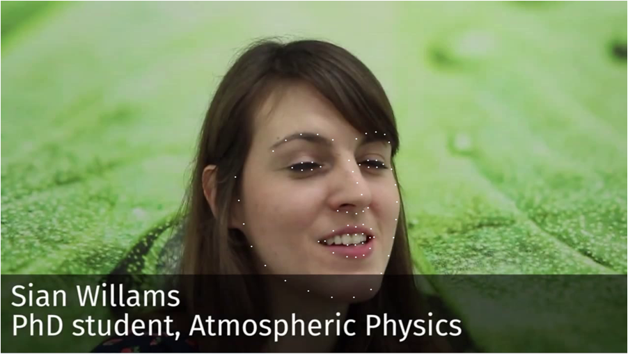
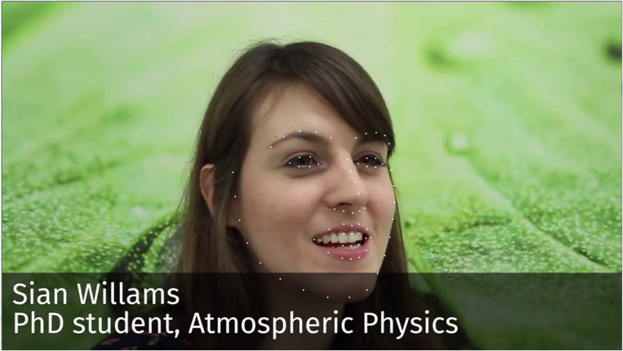

# 结果展示

# 主要采用 face++ 的一篇实现：Approaching human level facial landmark localization by deep learning  
实现人脸中68关键点的定位【人脸对齐】  

## database数据集说明：  
1.主要采用LFPW, HELEN, AFW, IBUG, 300W；【加入新的68关键点数据集，300VW 数据集：https://ibug.doc.ic.ac.uk/resources/300-VW/】  
2.数据增强操作：旋转，镜像或者缩放等操作；【同样可以增加一些随机遮挡】  
关于300vw：处理大概114个视频文件，得到223034张图片，每帧都有对应的pts文件，记录人脸关键点的位置；  

## 关于论文描述：  
1.论文中主要采用 级联的CNN卷积神经网络，第1阶段进行68点的粗定位，第2阶段实现精细定位；  
2.模型的训练：  
阶段1的训练，采用bagging的思想，选取4个批次样本，选择其中的3份样本，训练4个阶段1的网络；  
阶段2的训练，为了防止过拟合，阶段2使用的样本，是使用4个批次中，未参与阶段1的样本，在阶段1上的预测值，作为阶段2的训练样本的值；  

阶段1的训练之后，根据两眼的中心点 和 嘴巴的中心点，进行相似变换，进行人脸对齐操作；  
阶段2中，模型的输入，是每个坐标点周围的一个方形区域【24*24】，每个区域输出，离该点最近的K个点坐标；（后期实现使用的是K=1），论文中证明K=3时，效果最好；  
3.模型的评价指标【主要是计算预测坐标与真实坐标的均方根误差，并与两眼瞳孔之间的距离比】  

4.阶段1 和 阶段2 的模型实现，参考 DCNN_stage1.py 和 DCNN_stage2.py  

5.关于数据的预处理和最终在测试的时候，都是使用了人脸检测模型，这边使用的人脸检测模型是基于resnet_ssd的caffe model，具体的链接：  
<https://github.com/JWSunny/Facial_Expression_Recognition/tree/master/expressions_base_landmarks>；  

6.数据的预处理：由于网络的输入尺寸的是固定的，所以需要对人脸进行检测，同时保证所有的人脸关键点在人脸框中，并通过仿射变换操作转换到
固定的输入图片大小；  

## 移动端移植说明：  
1.移动端移植的宗旨肯定是希望在保证精度的情况下，尽量缩小模型的大小；在移动端移植的过程中，使用的是级联模型的第一阶段的网络；原始论文
中其实有说阶段1的粗定位其实已经能满足一般场景的人脸关键点定位操作；  

2.同时为了进一步缩小及加速模型，使用mobilenet的模型结构，重新设计定位模型，最终将之前阶段1的模型从28M缩小到7.7M；  
（该模型在PC端结合人脸检测模型，能实现实时的人脸关键点定位，在移动端不进行任何优化的场景下，华为畅享8人脸检测+定位300ms左右，红米note5上100-200ms）  

3.这边未进行最终模型的分享，主要分享自己在实现过程中的训练代码；以及如何将keras模型文件转换成tensorflow模型的pb文件；  
其实pb文件可以进一步量化成tflite文件，模型文件能进一步压缩，但是时间推理上，因为之前的tflite文件的优化理论上可以优化时间，但是像
基于mobilenet这种轻量级设计的网络，优化的推理时间有限；（具体实现请参考：DCNN_Mobilenet.py）  
